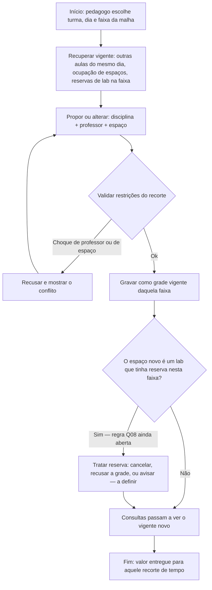

# Análise Inicial do Sistema — Antes da Modelagem de Domínio

**Sistema:** Gestão Escolar (grade de horários, alocação de espaços e reservas de salas especiais)  
**Equipe:** Victor Hugo Wille  
**Disciplina:** Desenvolvimento de Software Corporativo / Análise de Sistemas Corporativos  
**Data:** 01/09/2026  
**Documento de origem do método:** *Objetivo do trabalho* (processo de análise usado em aula com o CeliLac)  
**Documento anterior da equipe:** `trabalho_arquitetura_escola.md` (análise arquitetural — memória do projeto; regras de domínio abaixo **prevalecem** quando houver conflito)

---

## Como ler este documento

Este trabalho **não** define código, banco, APIs, classes, agregados nem arquitetura definitiva.

| Categoria | O que significa neste documento |
|-----------|----------------------------------|
| **Fato** | Afirmação com evidência apontada. Sem evidência, não é fato. |
| **Hipótese** | Suposição plausível que ainda precisa ser validada. |
| **Questão em aberto** | Lacuna que precisa ser investigada antes de concluir. |
| **Decisão** | Escolha da equipe, com justificativa (mesmo que provisória). |

**Regra adotada:** não tratar hipótese como fato. Stack (BaaS/Supabase, React, etc.) **não** é fato do domínio. Regras que a equipe **declarou** para o recorte do sistema entram como fato **do projeto** (o que o sistema deve respeitar), não como evidência de uma escola externa.

---

## 01 — Apresentação do sistema

**Nome (provisório):** Sistema de Gestão Escolar — grade dinâmica, salas e reserva de laboratórios.

**Problema que pretende resolver:**  
A escola precisa de uma **única grade vigente**, ditada só pelo pedagogo, que pode mudar **em qualquer dia**. Cada aula tem lugar e horário na malha da tarde. Salas comuns entram pela grade. **Laboratórios e outras salas especiais** podem ser reservados **somente** se, naquela aula (faixa de 50 minutos), **ninguém já estiver usando** aquele espaço. Sem isso, choque de professor/sala e reserva “por cima” de aula viram rotina paralela (planilha, recado, chave do lab).

**Contexto em que o problema ocorre:**  
Turno da tarde, aulas de 50 minutos, início às 13h, três aulas, intervalo de 20 minutos, encerramento às 17h30. Grade **não** é um cartaz estático do semestre: o pedagogo a altera quando precisar. Reservas não disputam sala de aula comum — só espaço especial ocioso na faixa.

**Quem é afetado:**

- **Pedagogo** — único que define e altera a grade.
- **Professores** — cumprem a grade vigente e (visão atual) solicitam lab se a faixa estiver livre.
- **Alunos** — precisam da grade **atual** (matéria, horário, local), inclusive depois de uma mudança no mesmo dia.
- **Direção** — não dita a grade neste recorte; cadastro de prédio/usuários, se existir, é apoio — **não** aprovação de reserva.

**Público-alvo / usuários principais:**  
Pedagogo (operador da grade), professor (consulta + reserva de sala especial ociosa), aluno (consulta da grade vigente).

**Objetivo principal da solução:**  
Apoiar o pedagogo a **manter a grade vigente coerente com a malha e com as ocupações**, e permitir reserva de laboratório **só em faixa sem uso**, para que consulta e reserva leiam o mesmo estado.

**Por que o sistema precisa existir:**  
A grade muda ao longo dos dias. Reserva de lab só faz sentido se o sistema souber, **naquela aula**, se o espaço já está ocupado. Sem isso, a reserva ignora a grade ou a grade ignora a reserva.

---

## 02 — Problema e contexto

### Recorte (decisão de escopo, não de tecnologia)

- **Só o pedagogo** monta e altera a grade (qualquer dia).
- **Malha da tarde** fixa (ver seção 03 / F09).
- **Sala comum:** ocupação pela grade, não por reserva.
- **Sala especial (ex.: laboratório):** reserva **apenas** se ninguém estiver usando naquela faixa de aula.
- Fora de escopo: secretaria completa (matrícula, boletim, financeiro).

### Malha horária adotada no recorte

A equipe definiu: aula de **50 min**, começa às **13h**, **3 aulas**, **20 min** de intervalo, termina às **17h30**.

Com isso, a única malha que fecha o relógio (3 × 50 min + 20 min + restante até 17h30 em blocos de 50 min) é:

| Faixa | Início | Fim | Observação |
|-------|--------|-----|------------|
| 1ª aula | 13:00 | 13:50 | |
| 2ª aula | 13:50 | 14:40 | |
| 3ª aula | 14:40 | 15:30 | |
| Intervalo | 15:30 | 15:50 | **não** é aula; reserva de lab neste intervalo **não** foi definida (Q06) |
| 4ª aula | 15:50 | 16:40 | derivada do término às 17h30 |
| 5ª aula | 16:40 | 17:30 | |

Se a equipe quiser outro número de aulas depois do intervalo, a malha muda (Q07).

### O que ainda não é evidência de escola real

H01 (planilha/mural) continua hipótese de *como* fazem hoje. As regras acima são **o que o sistema da equipe deve fazer**, declaradas pela equipe.

---

## 03 — Quadro de fatos, hipóteses, questões e decisões

| ID | Tipo | Descrição | Evidência / Como validar / Justificativa | Estado |
|----|------|-----------|------------------------------------------|--------|
| F01 | Fato | O projeto é gestão escolar centrada em **grade, salas e reserva de salas especiais**. | Documentos deste repositório + regras declaradas pela equipe em 01/09/2026. | Confirmado (projeto) |
| F02 | Fato | O **aluno** não monta grade nem reserva sala especial neste recorte; consulta o vigente. | Decisão de produto da equipe (documento anterior + recorte atual). | Confirmado no recorte |
| F03 | Fato | Uma aula no recorte cruza **turma, disciplina, professor, faixa da malha e espaço**. | Necessário para montar a grade e consultar local/horário. | Confirmado no recorte |
| F04 | Fato | **Reserva no sistema existe só para salas especiais** (exemplo dado: laboratório), não para sala de aula comum. | Declaração da equipe (01/09/2026). | Confirmado no recorte |
| F05 | Fato | A grade **vigente** é a que vale para deslocamento e aula; alteração do pedagogo atualiza essa referência (grade **dinâmica**). | Declaração: pedagogo muda a grade **qualquer dia**. | Confirmado no recorte |
| F06 | Fato | **Somente o pedagogo** dita a grade (criar e alterar). Professor e diretor **não** definem horário/sala da aula regular. | Declaração da equipe. Fecha a antiga Q02. | Confirmado no recorte |
| F07 | Fato | Laboratório (sala especial) **só pode ser reservado** se **ninguém estiver usando naquela aula** (faixa de 50 min). Aula na grade **prevalece**: faixa ocupada → reserva recusada. | Declaração da equipe. Fecha a antiga Q03. | Confirmado no recorte |
| F08 | Fato | Cada **aula** dura **50 minutos**. O turno descrito **começa às 13:00** e **termina às 17:30**, com **três aulas**, depois **20 minutos de intervalo**. | Declaração da equipe. | Confirmado no recorte |
| F09 | Fato | Malha da tarde fechada em **cinco** faixas de 50 min (`FaixaTurnoTarde`), intervalo 15:30–15:50 **fora** da malha de aula (Q07). | Decisão de modelagem + F08. | Confirmado no recorte |
| H01 | Hipótese | Hoje a escola ainda organiza grade/reservas em planilha, mural ou mensagem, com desatualização. | Validar com a escola-alvo. | Aberta |
| H02 | Hipótese | Choques a impedir na grade: **mesmo professor em duas turmas na mesma faixa** e **mesmo espaço (sala comum ou lab) em duas aulas na mesma faixa**. | A equipe ainda não listou outras regras (capacidade, vínculo professor–disciplina). | Aberta — plausível e alinhada ao recorte |
| H03 | Hipótese | ~~Reserva exige aprovação da direção.~~ | Contraria F04/F07: a regra declarada é **ociosidade na faixa**, não alçada do diretor. | **Rejeitada** neste recorte |
| H04 | Hipótese | Quem consulta (aluno/professor) precisa ver a mudança **no mesmo dia**, antes da próxima aula, senão vai ao lugar antigo. | A grade dinâmica (F05) **aumenta** a importância disto; o *meio* (app, mural, aviso) continua aberto. | Aberta |
| H05 | Hipótese | ~~Grade fecha no início do período e só muda em exceção.~~ | Contraria F05/F06 (qualquer dia, dinâmico). | **Rejeitada** neste recorte |
| H06 | Hipótese | Capacidade (carteiras / vagas do lab) é restrição além de “faixa livre”. | A equipe não afirmou isso. | Aberta |
| H07 | Hipótese | Quem **solicita** a reserva do laboratório é o **professor** (para usar o lab naquela faixa com sua turma). | Não foi dito explicitamente; só que a reserva existe e a condição de ociosidade. | Aberta |
| Q01 | Questão | Qual é a **escola-alvo** (ou o perfil: quantas turmas, só tarde, um prédio)? | Equipe / coordenação. | Aberta |
| Q02 | Questão | Quem publica/altera a grade? | — | **Resolvida** por F06 |
| Q03 | Questão | Reserva vs aula na mesma faixa? | — | **Resolvida** por F07 |
| Q04 | Questão | A reserva de lab é sempre **para uma aula da grade** da turma do professor, ou também para atividade extra (projeto, recuperação) sem aula na grade? | Equipe. | Aberta |
| Q05 | Questão | Falta de professor no dia: o pedagogo só esvazia a faixa, coloca substituto, ou junta turmas? | Pedagogia. | Aberta |
| Q06 | Questão | Reserva de laboratório é permitida **no intervalo** (15:30–15:50), que não é aula de 50 min? | Equipe. | Aberta |
| Q07 | Questão | Malha de 5 aulas / manhã / sábado? | — | **Resolvida** na modelagem: só turno da tarde, 5 faixas; sem manhã/sábado neste recorte |
| Q08 | Questão | Grade por cima de reserva no lab? | — | **Resolvida**: a grade prevalece; reserva é cancelada e emite `ReservaCanceladaPelaGrade` |
| Q09 | Questão | A alteração da grade vale **na hora** (próxima consulta já vê o novo) ou só a partir do **dia seguinte** / da **próxima faixa**? | Equipe. “Dinâmico” sugere imediato, mas não foi dito. | Aberta |
| Q10 | Questão | Duas reservas no mesmo lab na mesma faixa? | — | **Resolvida**: a segunda é recusada (`RESERVA_CONCORRENTE`) |
| D01 | Decisão | Recorte: grade + salas + reserva **só** de sala especial ociosa; sem secretaria completa. | Justificativa: dor = organização espacial/temporal da tarde e uso de lab sem furar aula. | Atual |
| D02 | Decisão | Aluno só consulta; não reserva lab neste recorte. | Sem evidência de que aluno reserve laboratório. | Atual |
| D03 | Decisão | Fluxo principal = **pedagogo mantém a grade vigente** (inclui mudança em qualquer dia). Reserva de lab é fluxo satélite com regra F07. | Valor central é a grade; reserva depende dela. | Atual |
| D04 | Decisão | Não tratar BaaS/mobile/web como requisito desta etapa. | Enunciado da disciplina. | Atual |
| D05 | Decisão | Não há “grade travada até o fim do bimestre”. Editar a grade **é** o caminho normal, não um desvio raro. | Segue F05/F06. | Atual |
| D06 | Decisão | **Q07:** malha única `FaixaTurnoTarde` (5 aulas). Intervalo não é faixa de aula nem de reserva. Sem turno da manhã neste recorte. | Fecha o relógio 13h–17h30 com blocos de 50 min. | Atual |
| D07 | Decisão | **Q08:** pedagogo aloca aula no lab → reservas ativas daquela faixa/lab são **canceladas**; evento de domínio. | Aula vigente é a autoridade espacial da faixa. | Atual |
| D08 | Decisão | **Q10:** no máximo **uma** reserva ativa por laboratório por faixa. | “Ninguém usando” inclui outra reserva. | Atual |

---

## 04 — Fluxo principal

**Fluxo escolhido:** *Pedagogo define ou altera a grade vigente de uma turma numa faixa da malha da tarde (disciplina, professor, espaço), com validação de conflito, e essa versão passa a ser a consultada.*

Não é cadastro de usuário. Também não é mais um “publicar uma vez no semestre”: **mudar qualquer dia faz parte do fluxo principal** (D05).

| Aspecto | Descrição |
|---------|-----------|
| **Objetivo** | Deixar a turma, naquela faixa, com aula coerente (sem os choques assumidos) e **oficial agora**. |
| **Quem inicia** | Pedagogo. |
| **Ponto de início** | Pedagogo escolhe turma + dia + faixa da malha (1ª a 5ª aula, conforme F09) e propõe ou troca disciplina, professor e espaço. |
| **Resultado que indica conclusão** | A faixa daquela turma está **vigente** com a nova alocação (ou o sistema **recusou** e a vigente anterior permanece). Consultas seguintes leem esse estado. |

### Reconstrução do fluxo

**Começo:** turma + dia + faixa.  
**Sequência:** ver o que já ocupa a faixa → propor → validar → gravar vigente → (possível efeito em reserva de lab) → consulta alinhada.  
**Dependências:** malha F08/F09; ocupação de outras turmas na mesma faixa; reservas de lab na mesma faixa (F07 e Q08).  
**Decisões:** aceitar a alocação; o que fazer se a grade “atropelar” uma reserva (Q08).  
**Resultado:** faixa vigente atualizada ou recusa.

### O que este fluxo não é

Não é lista de CRUDs. Cadastros de turma/professor/sala são suporte. Reserva de laboratório é **outro fluxo** (variação / satélite), amarrado à ociosidade da faixa.

---

## 05 — Análise detalhada das etapas

| Etapa | Quem age? | Entrada | Saída | Decisão | O que pode impedir? |
|-------|-----------|---------|-------|---------|---------------------|
| Escolher turma, dia e faixa | Pedagogo | Malha (F09), calendário do dia, turma | Contexto: “vamos mexer **nesta** aula de 50 min” | Qual faixa alterar | Faixa inexistente (ex.: tentar reservar como se intervalo fosse aula — Q06); pedagogo sem identidade de operador |
| Recuperar ocupação da faixa | Sistema | Turma, dia, faixa | Aulas vigentes de todas as turmas na faixa; reservas de lab na faixa; professores já alocados | — | Dados incompletos da grade do dia |
| Propor alocação / alteração | Pedagogo | Disciplina, professor, espaço (sala comum ou lab) | Proposta ainda não gravada | Qual combinação | Não saber se o espaço é “comum” ou “especial” (precisa estar classificado) |
| Validar restrições | Sistema | Proposta + ocupação | Aceite ou conflitos | Aplicar H02 se adotada; **sempre** aplicar F07 se o espaço for lab já ocupado por **aula** | Professor já em outra turma na faixa; sala/lab já com **aula**; lab com **reserva** (Q08 se quem age é o pedagogo na grade) |
| Gravar vigente | Sistema | Proposta validada | Faixa da turma atualizada; deixa de existir “versão antiga” como oficial | — | Falha ao gravar (seção 06) |
| Efeito sobre reserva de lab | Sistema e/ou pedagogo | Se o espaço é lab e havia reserva | Reserva cancelada, preservada ou bloqueio da alteração | Q08 | Q08 não resolvida → comportamento indefinido |
| Consultar vigente | Aluno e/ou professor | Identidade + turma ou aulas do professor; dia | Lista das faixas do dia: disciplina, horário da malha, local | — | Nada ainda definido para a turma; Q09 (quando a mudança “aparece”) |

---

## 06 — Caminho feliz, variação e falha

### 1) Fluxo principal (caminho feliz)

Pedagogo escolhe turma, dia e faixa da tarde → vê ocupação → aloca disciplina, professor e sala (comum ou lab livre de **aula**) → sistema não encontra choque → grava vigente → professor e aluno, ao consultar, veem matéria, 50 min correspondentes e local.

Inclui o caso “qualquer dia”: não há passo extra de autorização.

### 2) Variação de negócio

**Variação:** *Reservar laboratório (sala especial) numa faixa de aula em que ninguém está usando aquele lab.*

Percurso:

- alguém (H07: provavelmente o professor) escolhe lab + dia + faixa da malha;
- sistema verifica se **já existe aula** naquele lab na faixa (F07);
- verifica se **já existe outra reserva** na mesma faixa (não declarado — ver Q10 abaixo, tratada como questão);
- se livre de uso, a reserva **vale** (sem diretor);
- se há aula (ou outro uso), **não reserva**.

Isso **não** substitui a grade: a turma continua com sua aula na grade; a reserva só pede o **espaço especial** ocioso.

### 3) Situação de falha

**Falha de negócio:** tentativa de reservar o laboratório numa faixa em que **já há aula** (ou o lab já está em uso). O processo **não** se completa. Não há “reserva pendente de diretor”. A saída é recusa clara: a faixa não está ociosa.

**Falha complementar:** pedagogo tenta colocar **duas turmas** no mesmo espaço na mesma faixa, ou o mesmo professor em duas turmas na mesma faixa — recusa, vigente anterior permanece.

**Falha ainda aberta (Q08):** pedagogo joga uma **aula** para o lab em cima de uma reserva já feita — o sistema hoje **não tem regra** declarada.

---

## 07 — Operações derivadas do fluxo

| # | Operação | Por que o fluxo exige |
|---|----------|------------------------|
| OP1 | **Obter ocupação da faixa** | Sem malha + aulas + reservas daquela faixa, o pedagogo e a reserva de lab decidem no escuro. |
| OP2 | **Alocar ou alterar aula na grade vigente** | Único ato pelo qual o pedagogo dita a grade (F06, F05). |
| OP3 | **Verificar conflitos de alocação** | Choque de professor/espaço; lab já com aula se a proposta for para aquele lab. |
| OP4 | **Consultar grade vigente do dia** | Aluno/professor precisam do estado **depois** de qualquer alteração. Substitui a antiga “publicar uma vez”. |
| OP5 | **Reservar sala especial (laboratório) se a faixa estiver ociosa** | Variação F04/F07. |
| OP6 | **Recusar reserva quando a faixa do lab já está em uso** | Contraparte de OP5; é a falha de negócio explícita. |
| OP7 | **Classificar espaço como sala comum vs sala especial** | Sem isso o sistema não sabe o que pode ser reservado e o que só entra pela grade. |

Cadastro de usuário, senha e financeiro continuam fora. “Publicar rascunho” **saiu** do núcleo: a grade é vigente ao gravar (D05), salvo a equipe introduzir rascunho depois (hoje não declarado).

---

## 08 — Detalhamento de três operações

### Operação A — Alocar ou alterar aula na grade vigente (OP2)

| Campo | Descrição |
|-------|-----------|
| **Nome** | Alocar ou alterar aula na grade vigente |
| **Objetivo** | O pedagogo define o que vale **agora** para uma turma em uma faixa de 50 min. |
| **Entrada** | Pedagogo; turma; data (dia); faixa da malha; disciplina; professor; espaço. |
| **Processamento** | Carregar ocupação da faixa (OP1). Aplicar OP3. Se ok, substituir a aula vigente daquela turma na faixa. Tratar reserva pré-existente no lab segundo Q08 **quando essa regra existir**. |
| **Saída** | Faixa vigente atualizada **ou** recusa com o conflito. |
| **Regra/condição** | Só o pedagogo (F06). Qualquer dia (F05). Malha F08/F09. |
| **Possível impedimento** | Choque; Q08 indefinido; Q09 (efeito visível atrasado vs imediato). |

### Operação B — Verificar conflitos de alocação (OP3)

| Campo | Descrição |
|-------|-----------|
| **Nome** | Verificar conflitos de alocação |
| **Objetivo** | Dizer se a proposta pode coexistir com o restante da **mesma faixa** no mesmo dia. |
| **Entrada** | Proposta + aulas vigentes na faixa + reservas de lab na faixa. |
| **Processamento** | (1) Mesmo professor já alocado em outra turma na faixa? (H02) (2) Espaço já com **aula** na faixa? (3) Se o espaço é lab e a ação é **reserva**, já há aula **ou** uso na faixa? (F07) |
| **Saída** | Sem conflito ou lista do que colidiu (professor, espaço, reserva). Sem rearranjo automático. |
| **Regra/condição** | “Mesma aula” = mesma faixa da malha no mesmo dia. Intervalo não é faixa de aula até Q06. |
| **Possível impedimento** | Ocupação incompleta; Q08 (grade vs reserva). |

### Operação C — Reservar sala especial se a faixa estiver ociosa (OP5)

| Campo | Descrição |
|-------|-----------|
| **Nome** | Reservar sala especial (laboratório) em faixa ociosa |
| **Objetivo** | Garantir o lab **somente** quando ninguém o está usando naquela aula de 50 min. |
| **Entrada** | Lab (espaço especial); dia; faixa; solicitante (H07). |
| **Processamento** | Confirmar que o espaço é especial (OP7). Ver se existe **aula** naquele lab na faixa. Ver outras reservas na faixa (se a equipe proibir duas reservas — Q10). Se ocioso, registrar reserva. |
| **Saída** | Reserva confirmada **ou** recusa porque a faixa não está livre (OP6). Sem fila de aprovação da direção (H03 rejeitada). |
| **Regra/condição** | F04 e F07. Não se reserva sala comum por este caminho. |
| **Possível impedimento** | Aula já no lab; outra reserva; Q04 (atividade extra); Q06 (intervalo); Q08 depois se o pedagogo ocupar o lab. |

---

## 09 — Informações necessárias ao sistema

| Informação | Por que precisa existir (negócio) |
|------------|-----------------------------------|
| **Turma** | A grade é por turma; a consulta do aluno também. |
| **Dia letivo** | A grade é dinâmica **por dia**, não só “segunda genérica do semestre”. Sem o dia, “qualquer dia” não se registra. |
| **Malha de faixas** (1ª–5ª aula + intervalo) | Choque e reserva são por **aula de 50 min**. Sem faixas iguais, F07 não se aplica. |
| **Professor** | Choque de professor e consulta do professor. |
| **Aluno e vínculo com turma** | Saber qual grade vigente mostrar. |
| **Pedagogo** | Único autor da grade (F06). |
| **Disciplina** | O que ocorre na faixa. |
| **Espaço** | Onde a aula acontece. |
| **Tipo do espaço** (comum vs especial) | Só especial entra em reserva (F04). |
| **Aula vigente** (turma + dia + faixa + disciplina + professor + espaço) | O que o pedagogo grava e o que a consulta lê. |
| **Reserva de sala especial** (espaço + dia + faixa + quem reservou) | Impedir segundo uso e saber se a faixa do lab está ociosa. |
| **Uso na faixa** (aula **ou** reserva no lab) | F07: “ninguém usando naquela aula” precisa desses dois tipos de ocupação. |

**Não listado:** JWT, WebSocket, mapa SVG, aprovação da direção.

---

## 10 — O que ainda não sabemos?

### Hipóteses abertas

H01, H02, H04, H06, H07. H03 e H05 **rejeitadas** neste recorte.

### O que a equipe fechou nesta rodada

- Só pedagogo na grade; mudança qualquer dia.  
- Reserva só sala especial; só se a faixa estiver sem uso.  
- Malha da tarde: 50 min, 13h, 3 aulas, 20 min de intervalo, até 17h30.

### Questões que restam

Q01 (escola), Q04, Q05, **Q06, Q07, Q08, Q09**, e:

| ID | Questão | Por quê importa |
|----|---------|-----------------|
| Q10 | Duas reservas no mesmo lab na mesma faixa (dois professores, lab “livre de aula”): a segunda é recusada? | F07 fala em “ninguém usando”; uma reserva já é uso. |

### Maior incerteza no fluxo

**Q08** — pedagogo dinâmico vs reserva já feita. Sem isso, grade e reserva se contradizem no mesmo dia.

**Q09** — se a consulta não for imediata, “dinâmico” não chega em quem se desloca (H04).

### Informação que mudaria o fluxo

Turno da manhã (Q07); reserva no intervalo (Q06); aluno como solicitante de lab (contraria D02).

### Decisões técnicas ainda sem evidência

Stack, app, push, mapa. A grade dinâmica **aumenta** o argumento para consulta sempre atual; **não** prova notificação push.

---

## 11 — Reflexão da equipe

**O que ficou claro agora**  
O sistema não é “montar grade uma vez + diretor aprova quadra”. É **uma autoridade (pedagogo)**, **uma malha de 50 minutos**, **reserva de lab só no ocioso**, e **alteração como operação normal**.

**Hipótese de maior risco**  
H04 + Q09: grade muda hoje e quem se desloca ainda olha o horário de ontem. Q08: reserva “válida” invalidada em silêncio pela grade.

**Prioridade de investigação**  
Q08, Q09, Q07 (confirmar 4ª e 5ª aula e se existe manhã), H07 (quem reserva).

**O que exigiu mais discussão**  
Encaixar “3 aulas + intervalo + acaba 17h30” numa malha fechada, e o choque **grade dinâmica × reserva**.

**Ideia revista**  
Aprovação de reserva pelo diretor e reserva de quadra como caso central. Quadra **não** foi citada nesta rodada; só salas especiais / laboratório.

**Preparada para modelagem de domínio?**  
**Melhor que antes**, no recorte declarado: há conceitos estáveis (**Faixa**, **Aula vigente**, **Espaço especial**, **Reserva ociosa**, **Pedagogo como único autor**). Ainda **não madura** se Q08 e a malha (Q07) não forem fechados — esses dois mudam regras do modelo. Nível: **em evolução → razoavelmente fundamentada no recorte da equipe**, ainda sem evidência de escola externa (Q01).

---

## Apêndice — Uso de Inteligência Artificial

### Ferramenta utilizada

Cursor Grok 4.6, a partir do PDF da disciplina, do documento de arquitetura e das regras declaradas pela equipe em 01/09/2026.

### Finalidade do uso

Organizar fatos/hipóteses/questões e **atualizar** o recorte quando a equipe fechou regras (pedagogo, lab ocioso, malha, grade dinâmica) — sem inventar aprovação de diretor nem reserva de quadra.

### Principais contribuições

- Rebaixar H03/H05 e fechar Q02/Q03.  
- Derivar a malha de 5 aulas a partir de 13h / 3 aulas / 20 min / 17h30 e **marcar a derivação** (F09/Q07).  
- Elevar alteração “qualquer dia” ao fluxo principal (D05).  
- Explicitar Q08 (grade por cima da reserva).

### Hipóteses que a IA ajudou a revelar

- “Publicar rascunho” era cerimônia sem a regra dinâmica.  
- Intervalo de 20 min **não** é automaticamente reservável.  
- “Ninguém usando” inclui aula **e** provavelmente outra reserva (Q10).

### Questões novas

Q06–Q10.

### Decisões revistas

Reserva de quadra e aprovação da direção **saíram** do núcleo. Fluxo principal deixou de ser “publicar uma vez”.

### Sugestões da IA rejeitadas / a rejeitar

Não tratar as 4ª e 5ª aulas como fato de escola até a equipe **confirmar** Q07. A derivação é matemática do recorte, não observação de campo.

### Avaliação crítica

A IA só reorganizou o que a equipe disse. **Não** substitui Q01. “17h30 com 50 min” admite uma malha; se a escola tiver outro intervalo ou aula geminada, F09 cai.

### Questão final obrigatória

A equipe **consegue defender** F04–F08 e o fluxo do pedagogo sem a IA, porque são regras que ela própria enunciou. **Não** deve defender F09, Q08 ou o turno da manhã como se já fossem decididos. A responsabilidade é da equipe.

---

## Encaminhamento para a Modelagem de Domínio

Pergunta seguinte da disciplina:

> A partir dos fluxos, operações e informações, quais conceitos representam o domínio?

Candidatos (ainda **não** modelados): **Faixa de aula**, **Aula vigente**, **Espaço comum**, **Espaço especial**, **Reserva**, **Ocupação da faixa**, **Pedagogo**. Travar o modelo **depois** de Q07 e Q08, ou deixar essas regras explícitas como pontos de variação no modelo.
