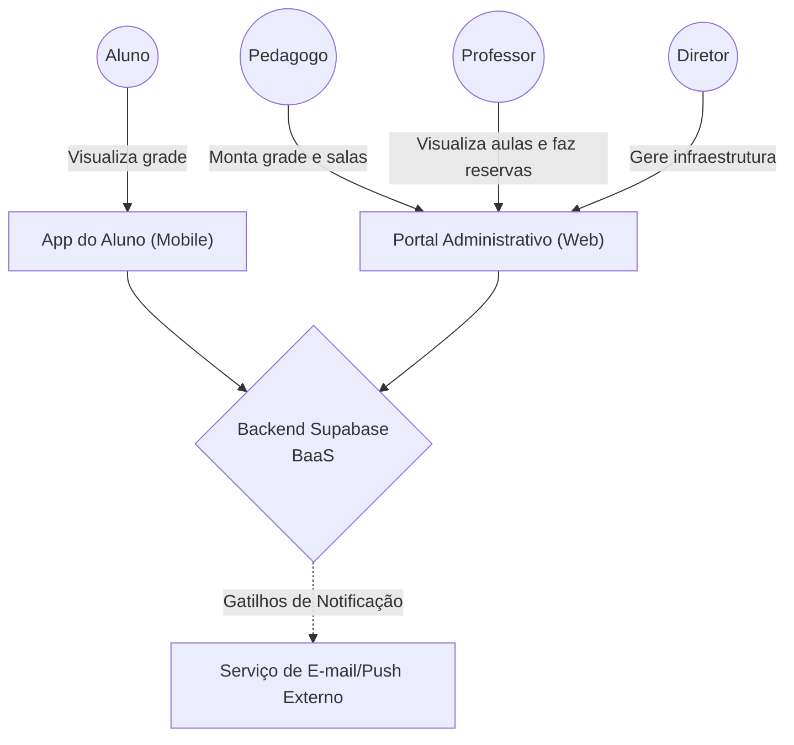
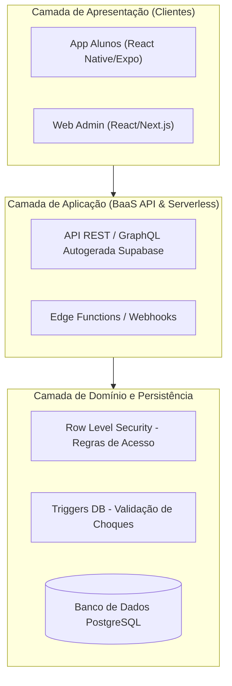
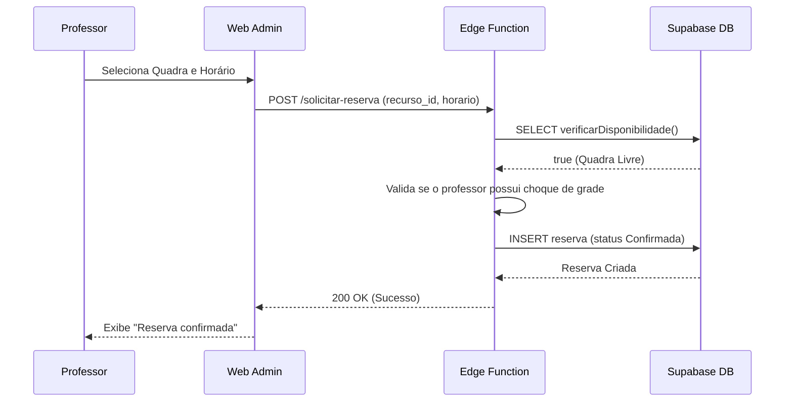
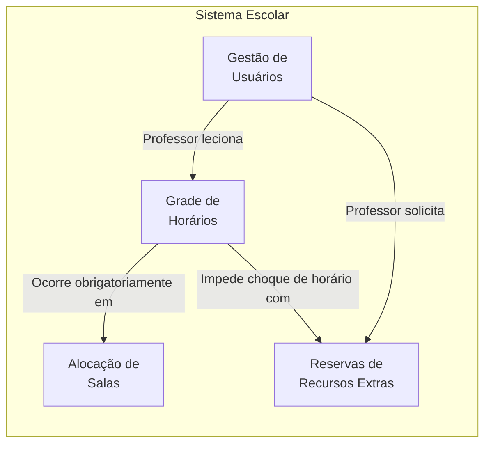

# Trabalho Avaliativo - Análise Arquitetural de um Sistema Corporativo

**Tema:** Sistema de Gestão de Escolas
**Grupo:** Victor Hugo Wille
**Disciplina:** Análise Arquitetural de Sistema Corporativo
**Data:** 25/08/2026

---

## 1. Introdução e Descrição do Problema

O sistema proposto visa modernizar a organização acadêmica e estrutural de uma escola. Historicamente, a gestão escolar enfrenta grandes desafios para montar o quebra-cabeça da grade de horários: definir qual aula ocorre para qual turma, em qual sala, garantindo que não haja choques de horário para os professores nem superlotação de espaços. Além disso, a reserva de espaços compartilhados, como quadras poliesportivas e laboratórios, muitas vezes sofre com controles manuais ineficientes.

O sistema centraliza essas operações, oferecendo uma visão clara do mapa de salas e turmas. Para facilitar o desenvolvimento e a experiência, o projeto adota uma arquitetura apoiada em um Backend-as-a-Service (Supabase), permitindo a separação em duas frentes independentes: uma aplicação web completa para diretores e pedagogos gerenciarem as regras, e um aplicativo móvel enxuto e focado para os alunos consultarem suas rotinas semanais e locais de aula.

---

## 2. Identificação dos Atores

- **Aluno (Consumidor):** Acessa o aplicativo móvel específico para estudantes. Seu perfil é apenas de leitura (*read-only*): ele visualiza a grade de aulas da sua turma na semana, sabendo exatamente qual matéria terá e em qual sala física deve comparecer.
- **Pedagogo / Coordenador:** Responsável por montar a grade de horários, alocar professores nas turmas e associar as turmas às salas de aula disponíveis. Utiliza o sistema web administrativo.
- **Professor:** Utiliza o sistema para visualizar seus horários de aula, as turmas que lecionará no dia e para solicitar reservas de espaços extras (laboratórios, quadra de esportes, sala de vídeo).
- **Diretor / Administrador:** Possui visão global. Cadastra os demais usuários, aprova reservas sensíveis e cadastra a infraestrutura (novas salas construídas, etc.).

---

## 3. Módulos do Sistema

A complexidade do negócio será dividida nos seguintes módulos principais:

- **Módulo de Grade Curricular e Horários:** O núcleo do sistema. Responsável por relacionar Turma, Disciplina, Professor e Dia/Horário da semana. Garante regras como: "Um professor não pode dar duas aulas no mesmo horário em turmas diferentes".
- **Módulo de Alocação de Espaços (Salas):** Relaciona a Grade de Horários com a estrutura física da escola. Informa onde cada aula vai acontecer e permite o mapeamento de quais salas estão ociosas em determinado período.
- **Módulo de Reservas de Recursos:** Gerencia a solicitação e aprovação de espaços compartilhados (Quadra, Laboratório de Ciências, Laboratório de Informática), evitando que dois professores tentem usar a quadra no mesmo horário.
- **Módulo de Gestão de Usuários:** Centraliza a identidade de alunos, professores e pedagogos, além de gerenciar permissões (Role-Based Access Control) garantindo que o App do Aluno acesse apenas os seus dados permitidos.

---

## 4. Arquitetura em Camadas

O sistema adota uma **Arquitetura Baseada em BaaS (Backend-as-a-Service)** suportada pelo Supabase, mas que, sob a ótica lógica, segue o padrão de camadas:

- **Camada de Apresentação:** Dividida em dois projetos físicos:
  1. *App do Aluno (Mobile)*: Consome dados para exibição de horários e salas.
  2. *Web App da Gestão*: Interface administrativa rica para pedagogos e professores.
- **Camada de Aplicação:** Como utilizamos o Supabase, parte da orquestração ocorrerá no próprio cliente (os apps comunicando-se via SDK nativo), enquanto fluxos críticos (como envio de e-mails de aprovação de reserva) rodarão em *Edge Functions* (funções serverless na nuvem).
- **Camada de Domínio:** As regras de negócio mais severas (ex: validação de choque de horários e sobreposição de reservas) residem parte nas Edge Functions e parte estruturadas como *Triggers* e *Policies* do banco de dados, protegendo a integridade.
- **Camada de Persistência:** PostgreSQL (gerenciado pelo Supabase), responsável por armazenar as entidades, gerenciar relacionamentos e aplicar políticas de segurança em nível de linha (Row Level Security - RLS) para garantir que alunos vejam apenas as grades de sua respectiva turma.

---

## 5. Diagramas Obrigatórios

### 5.1. Diagrama de Ecossistema

### 5.2. Diagrama Arquitetural

### 5.3. Diagrama de Fluxo do Sistema
**Caso de Uso Escolhido:** Professor solicitando reserva da Quadra Poliesportiva.

### 5.4. Diagrama de Módulos

---

## 6. Reflexão Arquitetural

### 6.1. Organização inicial do sistema
**Decisão:** O sistema será **Distribuído no Frontend (dois aplicativos separados), mas Centralizado no Backend em modelo BaaS**.
**Justificativa:** Dada a natureza dos usuários, criar dois projetos de frontend isolados oferece a melhor experiência: alunos precisam apenas de um app móvel leve e focado, enquanto pedagogos precisam de uma tela grande (dashboard web) com muitas ferramentas para montar o quebra-cabeças da grade. Como a equipe é reduzida (projetos acadêmicos), focar em microsserviços próprios seria inviável. Centralizar a lógica e persistência no Supabase permite ter a robustez de um backend profissional sem o custo operacional, concentrando os esforços no desenvolvimento das regras de domínio e interfaces.

### 6.2. Módulo de maior complexidade
O módulo de **Grade Curricular e Horários** apresenta a maior complexidade.
**Justificativa:** É um problema clássico de análise combinatória e restrições. O sistema precisa cruzar a disponibilidade de horário do professor, a carga horária da disciplina, a turma e a sala física (Alocação de Salas). Qualquer erro nessa lógica resulta em situações impossíveis, como duas turmas diferentes alocadas na mesma sala, ou um professor escalado para duas turmas simultaneamente no mesmo horário.

### 6.3. Desafios técnicos e arquiteturais
1. **Consistência de Restrições (Choque de Horários):** Garantir que inserções simultâneas por dois pedagogos no sistema não quebrem as regras da grade, colocando professores ou salas em choque.
2. **Segurança de Dados e Isolamento (Tenant):** O Aluno "A" não pode, de forma alguma, alterar a grade ou visualizar dados privados de turmas que não lhe dizem respeito, mesmo que os dois aplicativos utilizem a mesma API do Supabase.
3. **Desempenho em Picos de Leitura:** Às 07h00 da manhã de segunda-feira, a imensa maioria dos alunos abrirá o app simultaneamente para ver em qual sala devem ir. Isso gera um pico massivo de requisições de leitura ao banco.

### 6.4. Resposta arquitetural aos desafios
Para tratar os **choques de horário e concorrência**, o PostgreSQL utilizará restrições estruturais (*Constraints* de Unique Index por horário/sala) e *Triggers* para validar as transações antes da gravação no banco. Para o **isolamento de dados**, a arquitetura tira proveito profundo do RLS (Row Level Security) do Supabase: o token JWT injetado no App do Aluno restringe os comandos SQL no nível do banco para ler apenas a *row* da sua turma correspondente. Para lidar com os **picos de leitura matinais**, o App do Aluno implementará uma estratégia forte de *Caching Local* (offline-first), baixando a grade da semana no domingo e lendo do armazenamento local do celular na segunda-feira, poupando o backend.

---

## 7. ADR-001 - Decisão Arquitetural Inicial

**Contexto:** Definição da stack de infraestrutura e backend para suportar dois frontends distintos (App Mobile para Alunos e Web Admin para Pedagogos), considerando as restrições de uma equipe de apenas um desenvolvedor na faculdade.
**Decisão:** Adoção do padrão arquitetural **Backend-as-a-Service (BaaS) utilizando o Supabase**, em detrimento do desenvolvimento de uma API REST customizada do zero (ex: usando Node.js ou Java/Spring).
**Alternativas consideradas:**
- *Monolito Tradicional (MVC):* Descartado, pois dificulta a criação de um aplicativo nativo para o aluno (exigiria renderização de views em servidor em vez de respostas JSON).
- *API REST Customizada e Hospedada (Node.js + AWS):* Possível, mas consumiria grande parte do tempo do projeto configurando bancos, sistemas de login, endpoints básicos e infraestrutura de deploy, desviando o foco do domínio escolar.
**Justificativa:** O Supabase fornece banco de dados relacional (PostgreSQL), sistema de autenticação e uma API auto-gerada instantânea. Isso permite que os dois frontends comuniquem-se diretamente e com segurança (via RLS). A lógica de negócio essencial pode ser encapsulada em *Edge Functions* ou nas políticas do banco.
**Benefícios esperados:** Altíssima velocidade de desenvolvimento (*Time to Market*), abstração da complexidade de infraestrutura de servidores e extrema facilidade na gestão dos múltiplos perfis de usuários (Alunos vs Professores).
**Riscos e consequências aceitas:** Acoplamento com um fornecedor específico (*Vendor Lock-in*). Além disso, a Camada de Domínio acaba sendo dividida entre o Frontend e o Banco de Dados (Policies/Triggers), o que demanda muita disciplina técnica para que as regras de negócio não se tornem obscuras ou desorganizadas.

---

## 8. Funcionalidades Inovadoras

### 8.1. Notificações de Mudança de Sala em Tempo Real

**Funcionalidade:** *Push Notifications instantâneas para alunos via Supabase Realtime (WebSockets).*
**Descrição:** Quando o pedagogo realiza uma troca de sala de última hora (ex: "Matemática do 3ºA saiu da Sala 05 e foi para o Laboratório de Informática"), o aplicativo do aluno recebe uma notificação push instantânea, sem que ele precise reabrir o app ou atualizar a tela manualmente. Isso é viabilizado pelo recurso de **Realtime** nativo do Supabase, que utiliza canais WebSocket para escutar alterações em tabelas específicas do banco de dados.
**Necessidade do domínio atendida:** Um dos problemas mais frustrantes no dia a dia escolar é a troca de sala sem aviso prévio. O aluno se dirige à sala original, encontra a porta trancada e perde minutos procurando onde a aula está acontecendo. Essa funcionalidade elimina esse ruído de comunicação.
**Impacto na Arquitetura:**
- **Atores beneficiados:** O Aluno ganha informação em tempo real. O Pedagogo ganha confiança de que a mudança será comunicada instantaneamente, sem depender de recados em mural ou grupos de WhatsApp.
- **Módulos afetados:** O *Módulo de Alocação de Espaços* passa a emitir eventos ao ser atualizado. O *App do Aluno* ganha um listener (ouvinte) de WebSocket permanente conectado ao canal da sua turma.
- **Consequências Arquiteturais:** A arquitetura passa a lidar com **conexões persistentes** (WebSockets) em vez de apenas requisições HTTP pontuais. Isso impacta o consumo de bateria do celular do aluno (conexão mantida em background) e exige uma política de reconexão inteligente (o que acontece se o aluno perder o sinal Wi-Fi e reconectar 5 minutos depois? Ele precisa receber as mudanças que perdeu). O Supabase gerencia a infraestrutura de WebSockets, mas o App precisa implementar a lógica de *fallback* e sincronização local.

### 8.2. Painel de Ocupação com Mapa Visual da Escola

**Funcionalidade:** *Dashboard interativo com planta baixa simplificada da escola, exibindo o status de cada sala em tempo real.*
**Descrição:** O Diretor e o Pedagogo visualizam um mapa esquemático (planta baixa simplificada em SVG) da escola onde cada sala muda de cor conforme seu status atual: 🟢 Livre, 🔴 Ocupada, 🟡 Reservada. Ao clicar em qualquer sala, o sistema exibe detalhes como: qual turma está ocupando, qual professor está lecionando e até que horário a sala permanecerá ocupada. O mapa se atualiza automaticamente conforme os horários da grade avançam ao longo do dia.
**Necessidade do domínio atendida:** Coordenadores frequentemente precisam realocar turmas de última hora (professor faltou, sala com problema elétrico). Sem uma visão espacial clara, eles precisam abrir planilhas e cruzar informações mentalmente. O mapa visual transforma essa tarefa em uma consulta instantânea e intuitiva.
**Impacto na Arquitetura:**
- **Atores beneficiados:** O Diretor ganha uma visão gerencial poderosa do uso da infraestrutura. O Pedagogo consegue identificar salas ociosas em segundos para resolver emergências.
- **Módulos afetados:** O *Módulo de Alocação de Espaços* passa a fornecer dados em formato consumível pelo componente visual (coordenadas das salas no mapa SVG). O *Módulo Administrativo* ganha a tela do mapa como nova funcionalidade do Web App.
- **Consequências Arquiteturais:** O frontend Web precisa renderizar gráficos vetoriais (SVG) e sincronizá-los com os dados do banco. Combinado com o Supabase Realtime (da funcionalidade 8.1), o mapa pode atualizar ao vivo sem refresh. A principal consequência é a necessidade de armazenar metadados visuais (posição x/y de cada sala no mapa) no banco, criando uma nova entidade de "Layout Físico" na Camada de Persistência.

---

## 9. Cenário de Evolução

**Cenário Plausível:** A escola atinge capacidade máxima, adota o ensino híbrido e passa a ofertar aulas no contraturno. Surge a necessidade de os alunos, no mesmo aplicativo, não apenas consultarem a sala física, mas também assistirem a videoaulas e baixarem arquivos em PDF de exercícios complementares de EAD.
**O que permanece na arquitetura?** A separação dos aplicativos (Frontend) e o provedor BaaS (Supabase) permanecem. O modelo de permissões e segurança via Row Level Security (RLS) continuará protegendo os dados estruturados da escola.
**O que precisaria ser alterado?** O Módulo de Grade ganharia o conceito de "Sala de Aula Virtual". O aplicativo do aluno precisaria de integrações nativas de player de vídeo. Do lado do backend, seria necessário habilitar o uso do serviço de armazenamento em nuvem (Object Storage) e criar integrações via Webhook/Edge Functions para plataformas de videoconferência terceiras (ex: Zoom, Google Meet).
**A arquitetura proposta favorece ou dificulta essa evolução?** A decisão estrutural pelo Supabase **favorece** significativamente a evolução. Como o Supabase já possui um serviço de *Storage* integrado nativamente com o sistema de autenticação e RLS, anexar PDFs e hospedar vídeos curtos às aulas pode ser implementado rapidamente sem a necessidade de buscar um provedor adicional. A infraestrutura escolhida apoia plenamente essa expansão de domínio.

---

## 10. Conclusão

A transição da arquitetura para um **Sistema de Gestão de Escolas** evidencia que os desafios do design de software mudam de processos físicos para desafios de integridade lógica altamente acoplada. A decisão (ADR-001) de utilizar o modelo Backend-as-a-Service com Supabase demonstrou ser uma escolha estratégica poderosa para o contexto de um projeto de faculdade: ela absorve a complexidade infraestrutural de criar APIs do zero, permitindo que o foco do único desenvolvedor da equipe seja direcionado aos aplicativos clientes e às rígidas regras de domínio (prevenção de choques). A documentação demonstra que a arquitetura atende às complexidades atuais e já nasce preparada para assimilar cenários futuros, como a introdução do Ensino a Distância.
